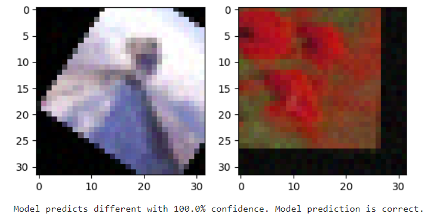

# To Bake or Not to Bake: Data Preparation Reflections

I have just recently completed my Image Equivalence Model project, which is available on [the portfolio page of my website](https://sean-bush.com/pages/portfolio). In it, I created a convolutional neural network capable of determining if two modified images originate from the same source. The project was conceived as an illustration of the skills necessary to build the kind of model you might see a company use if they wanted to provide a reverse image search algorithm. To that end, I needed a dataset that supplied transformed image pairs, some pairs containing images from the same source and others from different sources.

# My Data Perparation Process

I chose to take a common, easily accessible dataset as the source for my data. I looked originally through the datasts supplied by Torchvision for any pair datasets, but did not find any that met my needs. At that point, I decided to generate my own pairs from an existing dataset. I chose the CIFAR100 dataset as the large number of classes gave me confidence that the model would be unlikely to overfit to the particular types of images in CIFAR, and the low-resolution of the dataset was ideal for allowing my fairly weak personal computer to perform the analysis. Once I had decided upon this, I had a choice to make: to bake or not to bake. Do I generate the image pairs beforehand and save the results to a file, "baking" them beforehand? Or do I generate the images dynamically at runtime whenever the model loads a batch of data to train on? I will, for the rest of this article, refer to the former method as the "baking" method (parlance borrowed from the field of real-time computer graphics) and the latter as the "dynamic" method.

My first choice was the dynamic method, as it came with several key benefits. The first is that it provides an essentially infinite number of training examples for the model to learn from. When the model goes to load a training example, it randomly chooses whether the image pair will be derived from the same or different sources. It then generates two new images, accordingly performing a brand-new random transformation on each image. While calling the dynamic dataset "infinite" is somewhat misleading since the set of source images is finite, it is true that using the dynamic method means that no particular image pair will ever be seen more than once during training. This method goes a long way towards preventing overfitting, since the model is much less likely to "memorize" datapoints over the course of several training epochs, since they are never truly seen multiple times.

For the reasons listed so far, I used this dynamic method when I originally implemented the model. The method did indeed seem to prevent overfitting, but it also came with a significant drawback: performing these transformations at runtime was expensive. Very expensive. A single training epoch could take more than a minute to complete. The reality is that I was performing upwards of ten different transformations for each image: scaling, rotating, varying the hue, varying the saturation, varying the contrast, varying the brightness, blurring the image, and adding random noise. All of this was neccessary to simulate the kind of changes you would need to account for if you were trying to train a reverse image searching model, but it also meant that a significant amount of overhead was being added to the data loading process. This slowdown, combined with the fact that convolutional neural networks already take longer to train than other types of networks and the fact that my personal computer is not particurly a powerhouse, I decided that the dynamic method was simply not going to work for my analysis.

It was around half-way through the project when I completely rewrote the code managing the loading of data. Now, since I was "baking" the transformations beforehand, I needed to write a script to perform the baking and run it before any other analysis occurred. To this end, I wrote the script `preprocess_data.py`, which loaded the CIFAR dataset using torchvision, generated the sixty-thousand image pairs with transformations applied to all images, and saved the results to a number of numpy arrays files. An additional benefit to this methodology is that the images would no longer be loaded in a PIL format, as the CIFAR dataset does by default, but as raw pixel values. In the original implementation, every image had to be converted whenever it was loaded, adding yet another step to the process. All together, the optimizations I made by baking the transformations reduced the training times by about 60%-70%. An epoch that had originally taken more than a minute to complete was now taking twenty to thirty seconds to complete. The reduction came without a significant reduction in model quality as well, as the final model still achieved an accuracy of nearly 98% on unseen data.

# My Reflections

The lessons to be learned from this story is that there a number of factors that need to be considered when deciding whether or not to bake your transformations beforehand.

1. Are the transformations actually the source of your slowdown?

In my case, reducing the size of the transformations helped considerably. This is because the process was being significantly CPU-limited on my machine. I could not make full use of my computer's GPU because too much time was being spent processing the image transformations on the CPU before they could even be moved over to my graphics card. I could see this by monitoring my CPU and GPU usage while the model was training: the CPU was being used nearly to its full extent while the GPU was seeing almost no usage at all. For this reason, I knew that there was likely to be a speed-up, and indeed there was.

2. How significant is the risk of overfitting?

There is an issue primarily of dataset size that needs to be considered when one is deciding whether or not to bake transformations. One of the main advantages of the dynamic method is that it prevents overfitting since the model basically never sees the same training example twice. It is still possible for the model to overfit on the more general set of source images, but the risk of overfitting is significantly reduced. In my project's case, however, the size of the dataset in question gave me confidence that this would not be a significant issue. The CIFAR dataset contains over 60,000 images, and the subset I used for training contained 40,000 images. This means that even though the transformations were baked in, the model was still encountering 40,000 unique image pairs every training epoch.

3. Is the speed-up going to result in a better model or a worse one?

This is the most central question, and it synthesizes the information from the previous two. Baking your dataset comes with a trade-off: faster training times for fewer unique data points. It is obvious that the latter would create a reduction in model quality. However, a more subtle point to note is that the former can provide a boost in model quality as well. Reducing training times means that the model can train for longer, and longer training times can result in better model performance in some cases.

The decision of whether or not to bake your data comes down to this question: **is the increase in model performance caused by longer training times going to out-weigh the decrease in model performance caused by baking the data?** In my case, I predicted, and eventually confirmed, that the answer was yes. But there are certainly cases where the answer would be no: primarly in the case that the analyst had access to significantly more computing power. At the end of the day, it is the job of the analyst to assess their own resources and determine for themselves whether or not to bake their transformations. It is a rule that can be applied to data baking, or indeed to any other major decision point during a project: identify the advantages and disadvantages to a particular strategy and act accordingly.